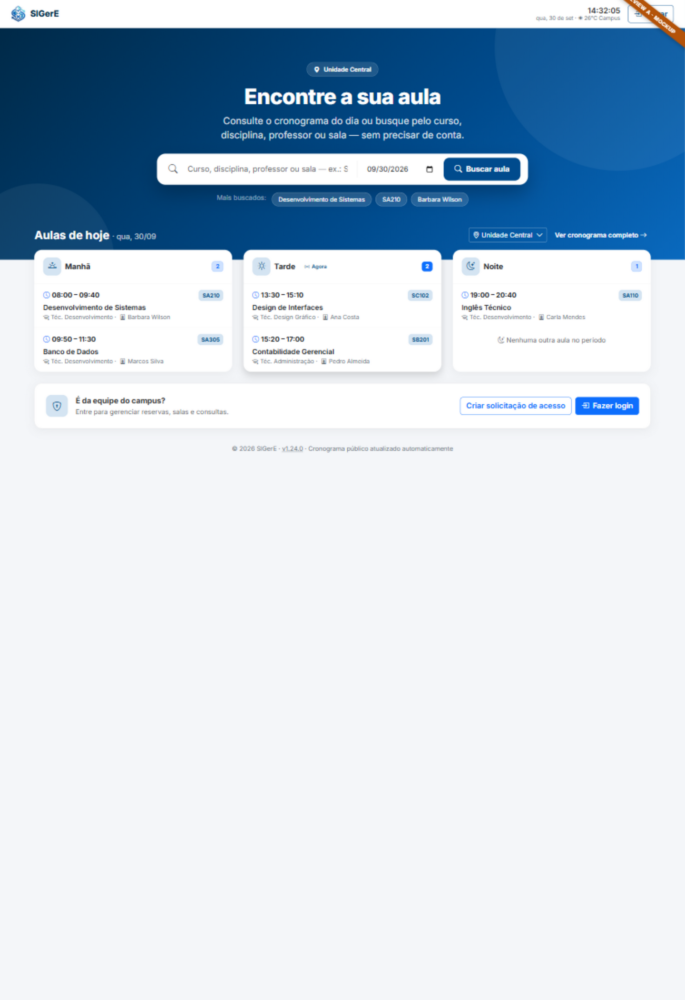
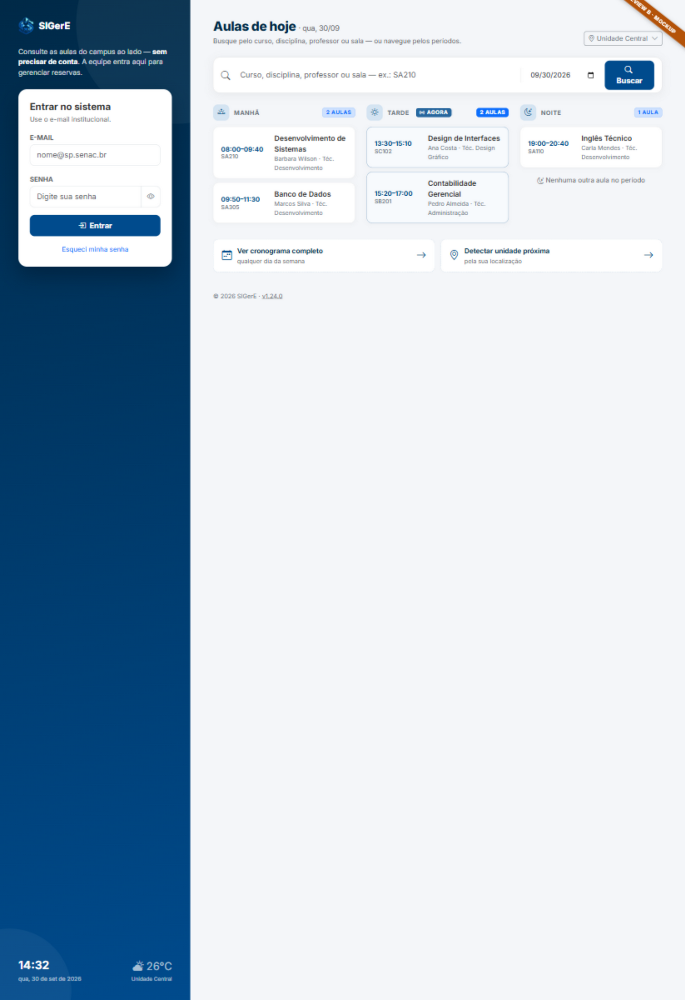
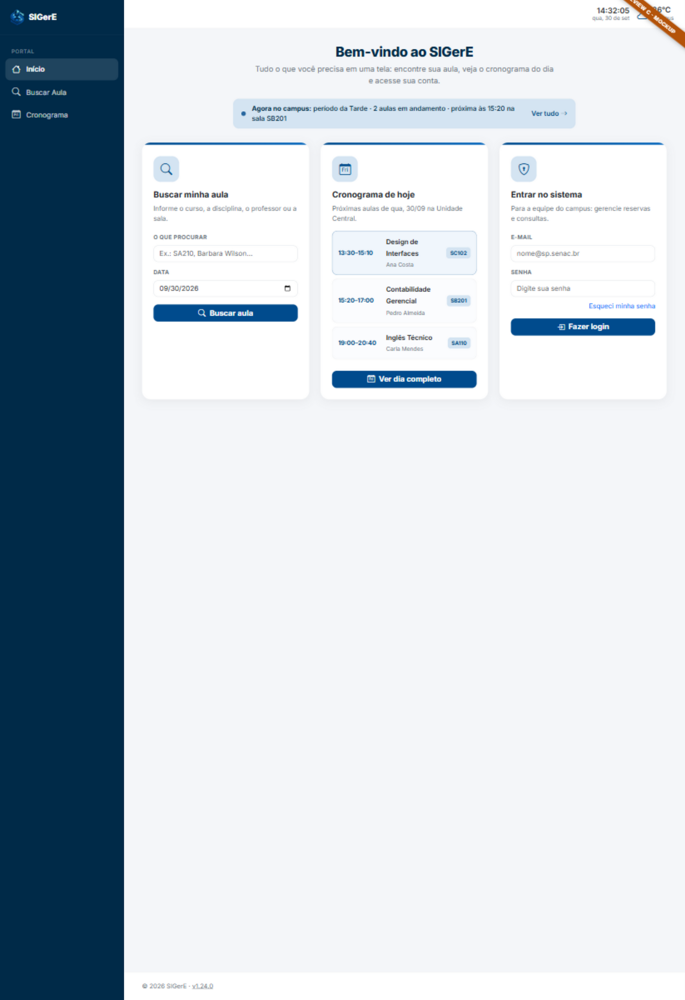

# Redesign da página inicial pública (home)

Propostas de redesenho da home do visitante (`/`, template `app/templates/home.html`) —
a página que reúne **busca de aula**, **cronograma do dia** e **login**.
Criada em 2026-09-30; três direções mockadas, aguardando escolha para implementação.

## Estado atual

A home de hoje (`app/templates/home.html`) é uma página de boas-vindas com três
cards **estáticos** que apenas linkam para as páginas reais
(`/buscar-aula`, `/cronograma`, `/auth/login` — rotas em `app/blueprints/public.py`).
O visitante precisa de dois cliques para fazer qualquer coisa útil.

Objetivo do redesign: trazer a função para a home — busca e cronograma
**executando na própria página** — mantendo a identidade visual
(azul Senac `#004b8d` / `#002a48`, Inter, Bootstrap Icons).

## As três direções

> Os HTMLs são mockups estáticos autocontidos (Bootstrap 5.3 + Inter + Bootstrap
> Icons via CDN) com dados fictícios. Abra direto no navegador — não há
> dependência do Flask. O logo é carregado de `app/static/img/`.

| Direção | Arquivo | Screenshot | Ideia |
|---|---|---|---|
| **A — Portal** | [preview-a.html](preview-a.html) |  | Hero com gradiente azul e busca grande integrada; cronograma do dia em 3 colunas logo abaixo; login como CTA no topbar e faixa no rodapé. Abandona a sidebar no portal público. |
| **B — Split** | [preview-b.html](preview-b.html) |  | Painel escuro fixo à esquerda com login sempre visível (relógio/clima no pé); busca e cronograma do dia no lado direito. Nova navegação, sem sidebar/topbar. |
| **C — Cards funcionais** | [preview-c.html](preview-c.html) |  | Mantém sidebar e topbar atuais; os 3 cards viram funcionais: form de busca inline, mini-cronograma com as próximas aulas e login direto no card. Faixa "Agora no campus" no topo. |

## Comparação

| Critério | A — Portal | B — Split | C — Cards funcionais |
|---|---|---|---|
| Impacto visual | Alto (landing) | Alto (app) | Médio (evolução) |
| Mudança de moldura | Sim — nova topbar, sem sidebar | Sim — sem sidebar/topbar | Não — reaproveita tudo |
| Busca na home | Sim (hero) | Sim | Sim (card) |
| Cronograma na home | Sim (3 colunas) | Sim (3 colunas) | Prévia curta + link |
| Login na home | CTA → página de login | Form completo na home | Form completo no card |
| Risco/escopo | Médio | Alto | **Baixo** |
| Mobile | Boa (colunas empilham) | Exige cuidado (painel vira topo) | Boa (cards empilham) |
| Tema escuro/accent | Precisa adaptar hero | Precisa adaptar painel | Herda tokens existentes |

**Recomendação: C** — entrega a home funcional com o menor risco (reaproveita a
moldura, os tokens e a navegação atuais). A é a melhor vitrine para o público
externo, caso o portal virar vitrine do campus; B faz sentido se o login passar
a ser o fluxo principal da home.

## O que muda na implementação (por direção)

Comum às três:
- `app/templates/home.html` — novo markup; os cards/busca passam a submeter
  `GET` para `public.class_search` (`q`, `data`, `unity`) sem nova rota.
- `app/blueprints/public.py` — a rota `home` passa a buscar no banco: aulas do
  dia na unidade pública (reaproveitar `_aulas_do_dia()` e `PERIODOS_DIA`,
  já usados por `/cronograma` e `/buscar-aula`) e, para B/C, nada além disso
  (o form de login aponta para `auth.login` como hoje).
- `app/templates/_unidade_publica.html` + `_aula_macros.html` — reutilizar
  (seletor de unidade e item de aula) para a home não divergir do cronograma.

Por direção:
- **A**: mover o cabeçalho/menu do visitante da sidebar para uma topbar
  (`base.html` ganha variação sem sidebar para anônimos na home — hoje
  `ocultar_sidebar` só é usado no totem); CSS do hero em `style.css`.
- **B**: idem — nova estrutura de layout exclusiva do portal anônimo;
  form de login real (CSRF + WTForms) embutido no painel.
- **C**: só `home.html` + um bloco de CSS no `scripts` do template (padrão
  atual); faixa "Agora no campus" usa `periodo_atual` de `_periodo_atual()`.

## Pontos de atenção

- **Tema escuro e accent**: a home é pública (mesma `base.html`); testar os
  previews com o dropdown de aparência depois de implementado.
- **Relógio/clima do visitante**: o topbar anônimo carrega clock + open-meteo
  (`base.html`) — preservar na direção C; A e B já os integram no layout.
- **Unidade pública**: manter a precedência `?unity=` → sessão → primeira
  ativa (`_public_unity()`); o seletor só aparece com 2+ unidades.
- **Sem aulas / sem unidade**: replicar os estados vazios do cronograma.
- **Testes visuais**: receita em [desenvolvimento-debug.md](../desenvolvimento-debug.md)
  (banco demo via `DATABASE_URL`, porta 5001).

## Status e próximos passos

- [x] Mockups A/B/C criados e renderizados (1440px, dados fictícios)
- [ ] **Pendente: escolher a direção (ou combinação) — decisão do usuário**
- [ ] Implementar o template escolhido em branch `feature/redesign-home-*`
- [ ] Validar mobile (empilhamento) e tema escuro/accent
- [ ] PR → `dev`
